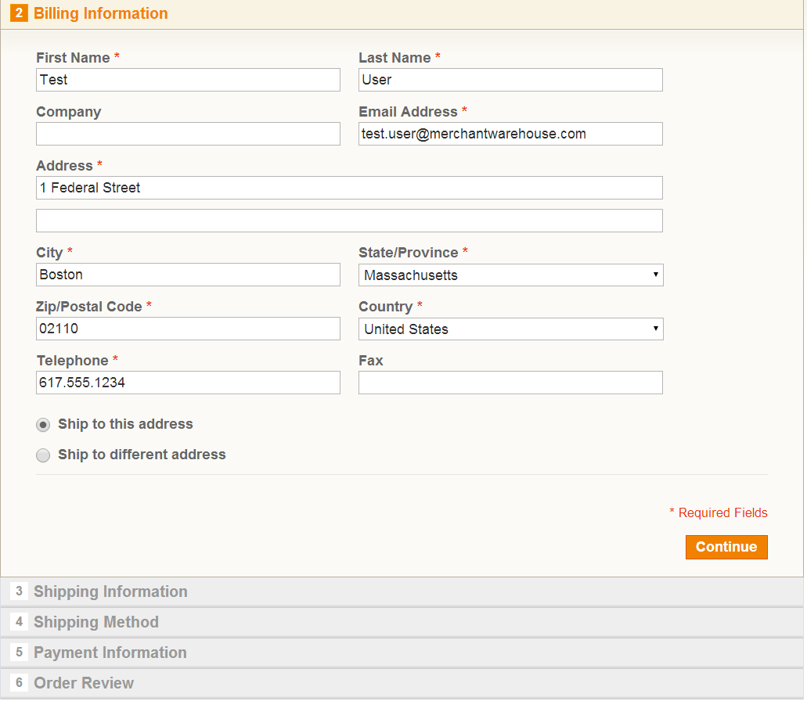
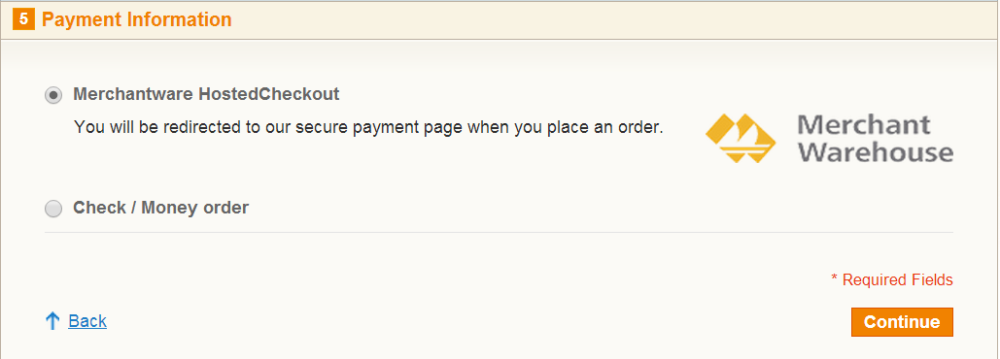
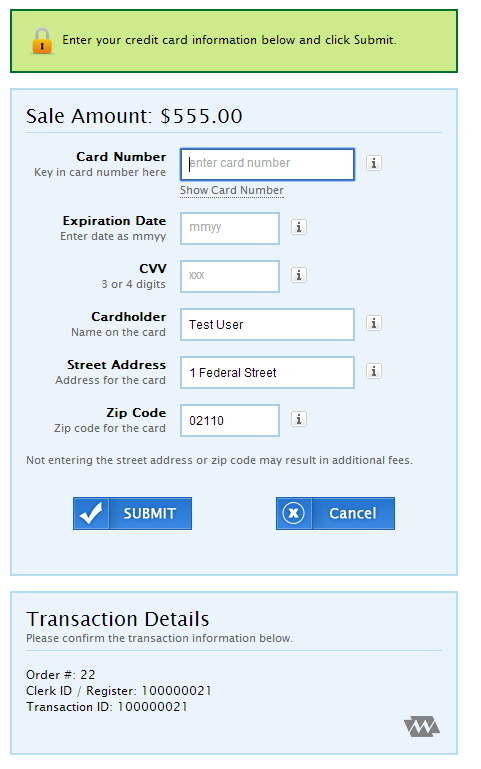

#magento

[Magento](http://magento.com/) offers flexible, scalable eCommerce solutions designed to help you grow and succeed online. Magento's cost-effective technology platform makes it possible for you to control the content, functionality, look and feel of your online store.

The Magento ecommerce platform provides a plug in architecture to self integrate payment and processing products.

Merchant Warehouse is offering two Magento plugins - one supporting Credit & Debit cards, and one supporting Gift cards. These plugins may be used separately or together.

# Quick Usage Guide

## Entering Billing Information

As part of the Magento checkout process, your customers will be prompted for their shipping and billing information. This info will be passed on to other screens later in the checkout process.

## Entering Payment Information

Your customers will then be prompted to pay using Merchant Warehouse's hosted payments page.

## Entering Payment Details

After you've entered your billing and payment information, you'll be redirected to MerchantWarehouse's Transport.Web hosted payments page. Here, your customers will be prompted for their credit card information. Most fields will be pre-populated with the information entered on the previous screens. When they're done entering their payment info, they'll be redirected back to your site, and asked to review & finalize their order.

# Installation

Installing Merchant Warehouse's Magento plugins is easy. Once you have signed up for a Merchant Warehouse account, you just need to enter in a few details to be up and running. Please follow the simple guides below:

* [Credit Card Plugin Installaton Guide](https://github.com/merchantwarehouse/shopping-cart-integrations/wiki/Magento-Credit-Plugin-Installation-Guide)
* [Gift Card Plugin Installation Guide](https://github.com/merchantwarehouse/shopping-cart-integrations/wiki/Magento-Gift-Plugin-Installation-Guide)

# Source code, issues, and feature enhancements

[MW Magento Plugins' source code](https://github.com/merchantwarehouse/shopping-cart-integrations) is hosted on GitHub, along with all of our other Open Source projects. All issues and feature enhancements are being tracked in our the [GitHub Issue Tracker](https://github.com/merchantwarehouse/shopping-cart-integrations/issues?state=open). Please tag issues with the "magento" label.

# Downloading
Currently, Merchant Warehouse’s magento plugins are only available as a source download.

# Contributing
We love contributions! Please send [pull requests](https://help.github.com/articles/using-pull-requests) our way. All that we ask is that you please include unit tests with all of your pull requests.

#Getting help
We also love bug reports & feature requests. You can file bugs and feature requests in our Github Issue Tracker. Please consider including the following information when you file a ticket:
* What version you're using
* What command or code you ran
* What output you saw
* How the problem can be reproduced. A small example project zipped up or code snippet that demonstrates or reproduces the issue is always appreciated.

You can also always find help on the [shooping cart integrations Google Group](https://groups.google.com/forum/#!forum/stumps-project). TODO
